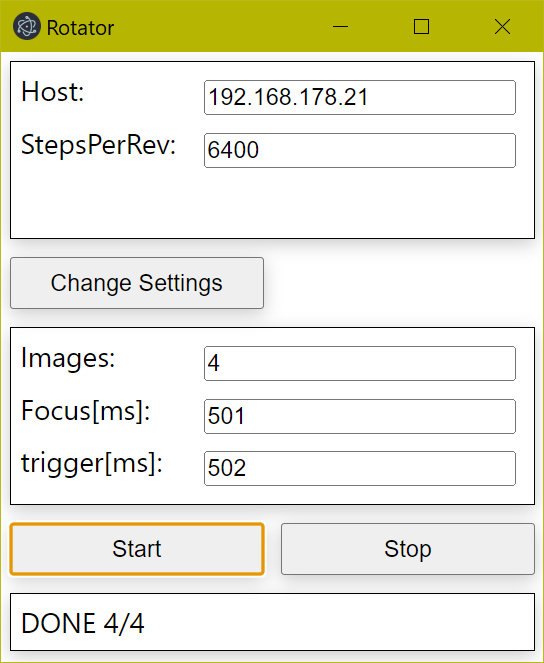

# remote-object-rotator-and-camera-trigger



## Setting WiFi credentials

- Power the flashed ESP32
- It starts new access point
- Connect to AP and it should open the settings dialog
- Change Settings, unplug and plug-in the device

## Handlers

### Status 

- http://x.x.x.x/status
- GET
- no parameters
- no body

Example:

```json
{
  "pos": 4000,
  "running": false
}
```

### Camera

- http://x.x.x.x/camera
- POST
- no parameters

Body (Example):

```json
{
  "focus": 500,
  "trigger": 1000
}
```

means: 500ms camera focus time and 1000ms camera trigger time. 

### Stepper-move

- http://x.x.x.x/move
- POST
- no parameters
 
Body (Example):

```json
{
  "move": 1000,
  "off-after-move": true
}
```

means: 
- rotating the motor 1000 steps
  - negative values are allowed
- switch the motor off after the motion 
  - optional
  - default: false
